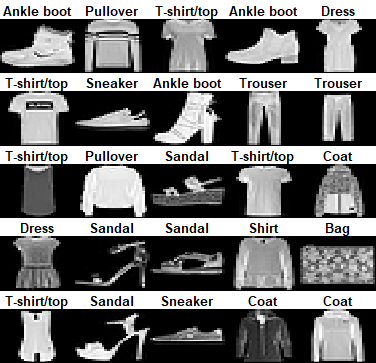
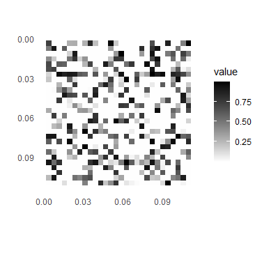

```{r setup, include=FALSE}
knitr::opts_chunk$set(echo = TRUE)
```

## Overview

The aim of this project is to build an image generator capable of producing a new, interesting image based on a set of provided images. I'm building this with very little knowledge of best methods for image classification or generation, or really training them at all, as a challenge for myself to see what I can come up with just by thinking logically.

I'm a big believer in trying to do stuff I have no idea how to do. The results may not be fantastic, but it certainly helps me understand the subject and any potential problems on a deeper level than just "this code's not working!"

If you're here early, and have any experience in the field, this might be painful. Apologies.

## Current plan

* Build basic multi-class image classification model based on Fashion-MNIST
* Create a random starter image
* Make random adjustments to the image, keeping any version that meets certain criteria.



## Multi-class Image Classification Model

To start with, I've used the code from <a href="https://tensorflow.rstudio.com/tutorials/beginners/basic-ml/tutorial_basic_classification/">this article</a> to build a basic image classifcation model with Tensorflow in Rstudio.

## Image Generation

As a starting point, I'm looping through the base image values, adding random values to a random number of random pixels, and keeping any version that meets the set criteria. These criteria are currently changing quickly as I experiment with it, but I'll make note of any significant points here.

* Using two separate criteria, one adjusting a large number of pixels, and another only adjusting a few seems to move the "evolution" of the image along quicker.
* The model had a tendency to predict one category as 100% probability - turns out I hadn't normalised the data. Exploring whether this is still a problem now, but it doesn't seem to be.
* The next ideas I'm exploring are something to "inverse" each pixel on each loop to see if it can get to a general outline quicker, also thinking of having the model "sketch" lines to see what happens.


## Current Results



### v0.000...1
Just for the sake of a fun before and after (hopefully), here are the results from my very first few attempts while getting my head around the concept.

Method

* 200 iterations
* The first method adds between 1 and 20 random pixels and tests to see if the probability is closer to 0.8 for category 3 (Pullover)
* The second method adds between 30 and 200 random pixels with a target probability of 0.7.

It's already clear I'll need a much better model.

``` {r attempt_1, message = FALSE, warning = FALSE, eval = FALSE}
current_predictions
current_image <- random_image / 255
it_img <- img
imp <- 0

for (i in seq(1:200)) {
  image_it <- current_image
  pix <- runif(1, 1, 20)
  image_it$value[c(runif(pix, 1, length(image_it$value)))] <- c(runif(pix, 0, 255)) / 255
  it_img[1, 1:28, 1:28] <- image_it$value
  
  pred <- model %>% predict(it_img) 
  
  if (pred[3] >= current_predictions[3]) {
    imp <- imp + 1
    current_predictions <- pred
    img <- it_img
    current_image <- image_it
  }
  
  image_it <- current_image
  pix <- runif(1, 30, 200)
  image_it$value[c(runif(pix, 1, length(image_it$value)))] <- c(runif(pix, 0, 255)) / 255
  it_img[1, 1:28, 1:28] <- image_it$value

  if (pred[3] >= current_predictions[3]) {
    imp <- imp + 1
    current_predictions <- pred
    img <- it_img
    current_image <- image_it
  }
  
}
```

